# Visual / UX Audit — June 2026

**Goal:** push the UI toward *engagement* — new-player clarity, readability,
and visual *pop* — without losing the dark-gothic identity. Bold direction:
layout & hierarchy rework, a real theming system, and custom SVG art.

All captures are iPhone-portrait (390×844), driven through the dev menu on the
exported web build (`scripts/audit-capture.mjs`).

---

## What changed (foundation)

### 1. A theming system (`theme/palette.ts`)

Colour accents are now **theme-driven**. A registry of named palettes is derived
from ~17 base hues via `makePalette()`; `theme/axm.ts` resolves the active
palette **once at module-load**, so all 150+ components that read `AXM.*` pick up
the theme with **zero per-component change**. Switching reloads the bundle so the
new palette re-resolves cleanly (robust against React Native's static
`StyleSheet.create` caching).

- **Integrated default — `Ashen Gold`:** the canonical palette retuned toward
  richer, higher-contrast accents (brighter gold, a more saturated blood-red,
  crisper parchment). This is the "pop" you see on *every* screen below.
- **Dev switcher (`DebugThemeSwitcher`):** buttons in the SELF-tab dev menu flip
  the active colour theme live — a preview harness for the future biome worlds.
- **Biome preview themes:** `Coastal Verdant`, `Ember Depths`, `Frost Marrow`,
  `Plague Bloom` (see the gallery at the bottom).

### 2. Custom SVG art

- **`TitleEmblem`** — a heraldic crest (a radiant *eye of knowledge* above a
  *sword of steel*, framed by an astrolabe ring + sulfur halo). Theme-aware.
- **`EncounterIllustration`** — rewritten from a crude placeholder into a moonlit
  clearing: a horned creature with glowing eyes, a layered treeline for depth, a
  glowing moon, and drifting embers.
- **`FiligreeRule`** — reusable diamond-centred divider for framing text blocks.

---

## Screen-by-screen

> Left = **before** (pre-audit). Right = **after**.

### Title
The weakest first impression — all text, dead-empty top. Now anchored by the
crest, with a glowing wordmark, a framed gold subtitle, filigree-framed flavor,
and a glowing call-to-action.

| Before | After |
|---|---|
| 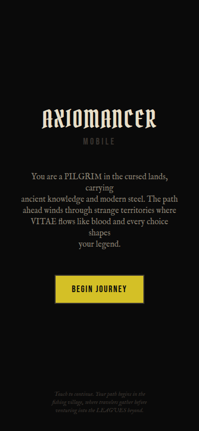 | 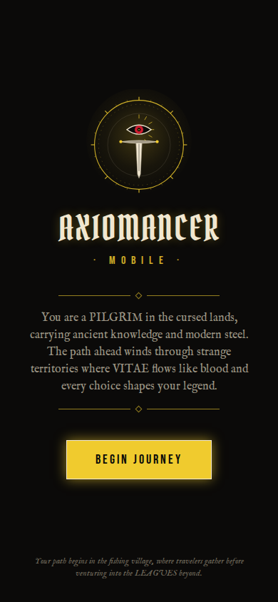 |

### Exploration (WILDS) — **map revamp**
Bigger, more-defined nodes (each glyph now sits on a backing disc with a bolder
rim so it reads as a distinct *stop*); straight, road-cased node-to-node edges
(replacing the faint wobbly curves) so the graph reads as a connected route.
Still pinch/pan scrollable. Plus the global palette lift.

| Before | After |
|---|---|
| 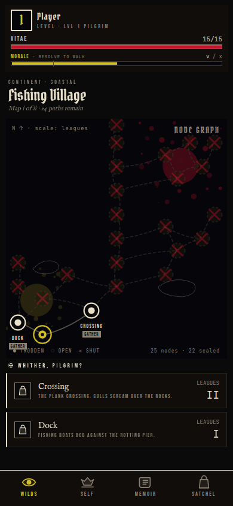 | 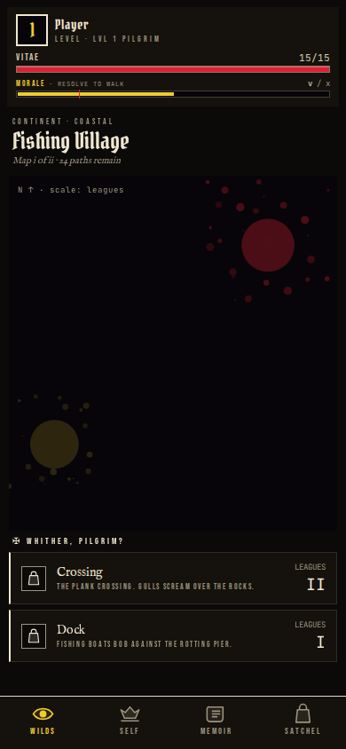 |

### Character / SELF — **complete revamp → D&D character sheet**
Was a long full-width scroll with a wasteful full-width DERIVED table. Now a
proper character sheet that **fits one screen, no scrolling**: hooded-pilgrim
**portrait bust top-left** (new `PlayerPortrait`), identity + alignment + XP,
level box top-right; boxed **ABILITIES**; **DERIVED and SAVES & TESTS side-by-side**
in two columns; collapsible MORALE LEDGER; **WORN & WIELDED removed** (equipment
lives in SATCHEL). The "before (mid)" shot below shows how far it used to scroll.

| Before (top) | After (full sheet, one screen) |
|---|---|
| 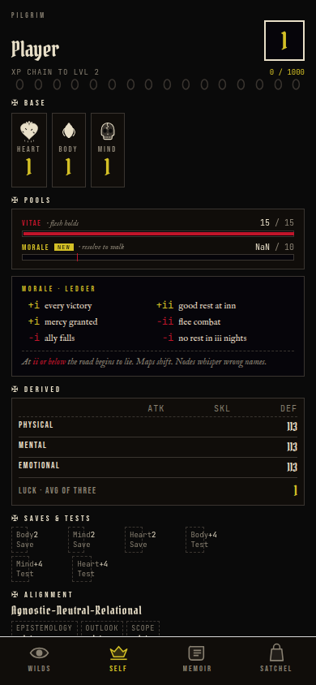 | 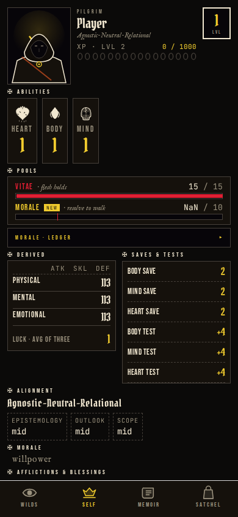 |

| Before (had to scroll this far) | — |
|---|---|
| 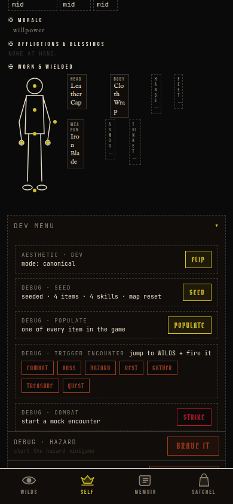 | |

### Satchel
| Before | After |
|---|---|
| 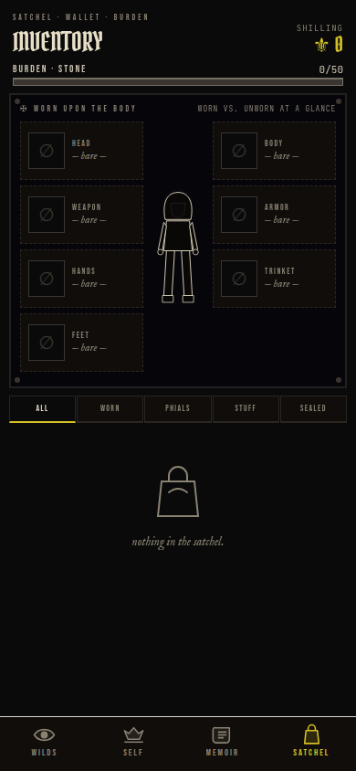 | 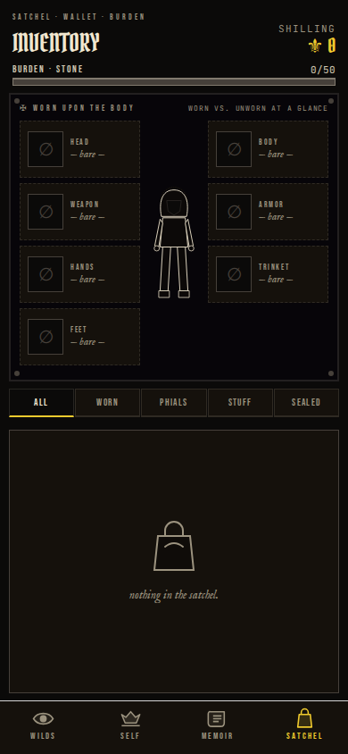 |

### Memoir
| Before | After |
|---|---|
| 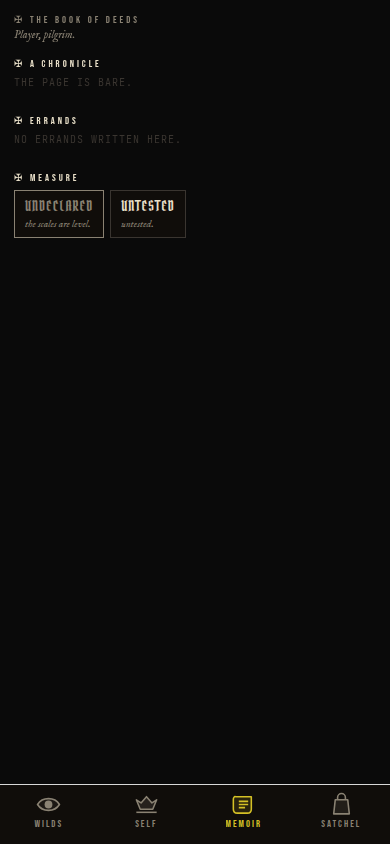 | 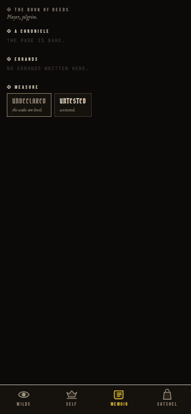 |

### Combat prelude — **bespoke enemy art**
The headline art change. The placeholder creature scene became an atmospheric
moonlit clearing, and the foe is now drawn to match its identity: the
**Salt-Gnaw Rat** prelude shows a *rat*, not a generic creature. Each of the
40+ roster enemies maps onto a recognisable archetype (see gallery below) via
`resolveEnemyArchetype`, with a generic fallback so coverage is total.

| Before (generic placeholder) | After (bespoke rat) |
|---|---|
| 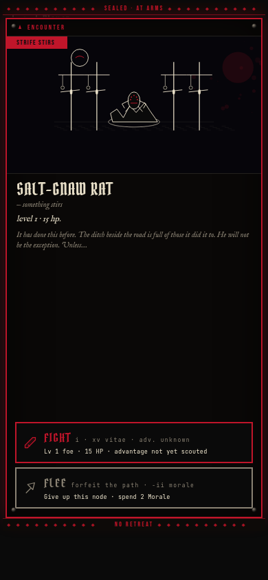 | 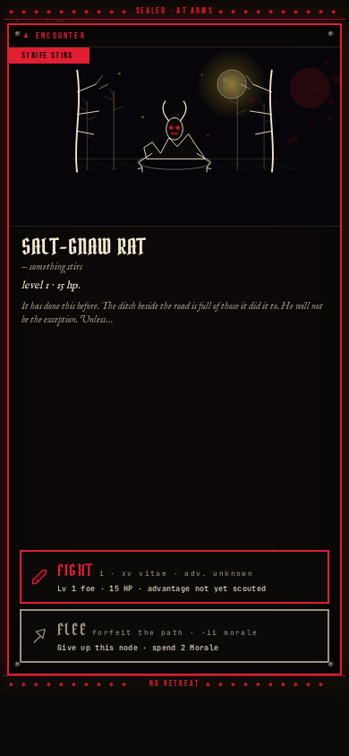 |

### Bespoke enemy archetypes
Ten distinct silhouettes drawn in a shared moonlit `CreatureScene`. A rat ≠ a
crab ≠ a wraith ≠ a saint. (Dev gallery at `/devart`.)

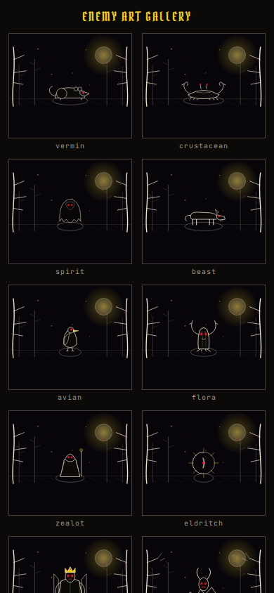

### Combat — choose a stance  ⚠️ **layout bug fixed**
The three stance cards were a fixed 160px and overflowed the 390px screen,
clipping both edges — **the MIND stance was unreachable**. Cards now flex to
share the row, so all three stances (and their ADV/DIS badges) are visible and
tappable. Plus the global palette lift on selection gold + vitae red.

| Before (Mind clipped) | After (all three fit) |
|---|---|
| 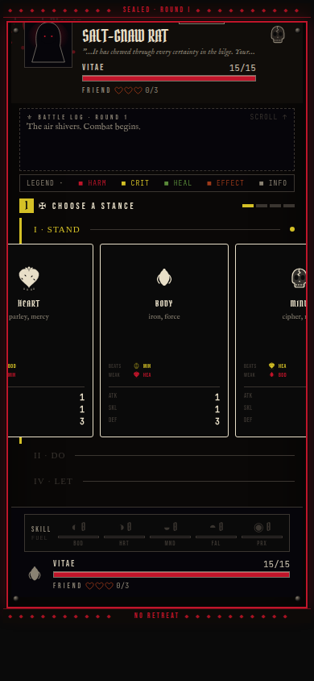 | 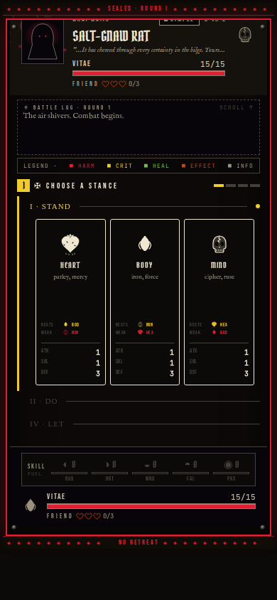 |

> The top-left enemy portrait is now the **bespoke archetype figure** keyed to
> the foe (a rat for the Salt-Gnaw Rat), matching the prelude — not the old
> generic hooded silhouette.

### Combat — DO (action menu)
Stance locked in (collapses to a summary line); the Attack/Defend/Skill/Item
2×2 grid was already responsive — it gets the palette lift.

| Before | After |
|---|---|
| 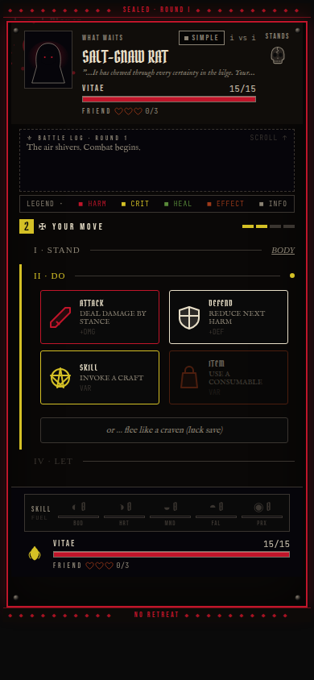 | 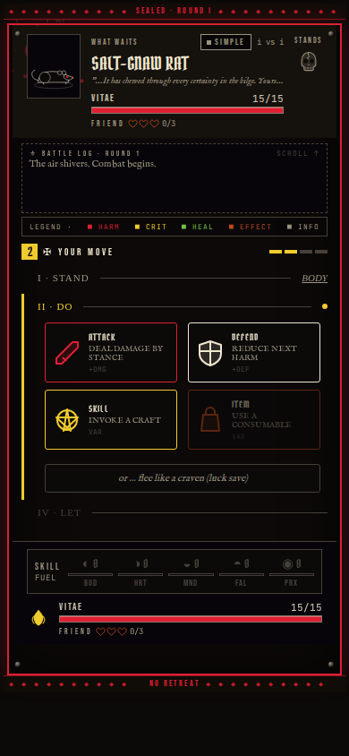 |

### Combat — LET (strike resolves)
The roll bars (you vs. foe), ripples, and COMMIT read with stronger gold/red
contrast.

| Before | After |
|---|---|
| 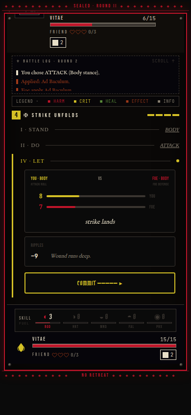 | 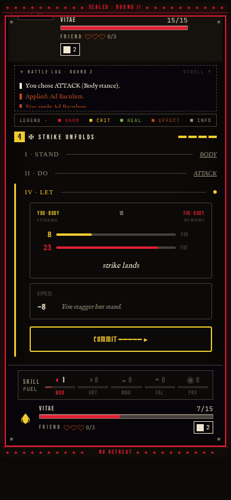 |

### Combat — round 2 stance
The clearest demonstration of the stance fix: all three stances visible with
their ADV (gold) / DIS (red) badges, so the rock-paper-scissors read is legible.

| Before (clipped) | After |
|---|---|
| 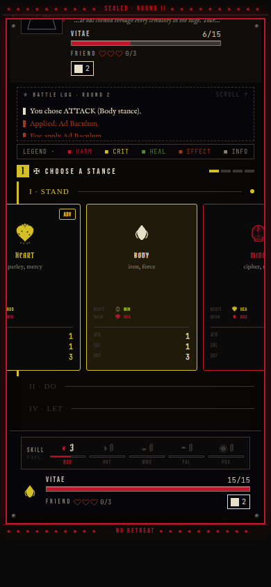 | 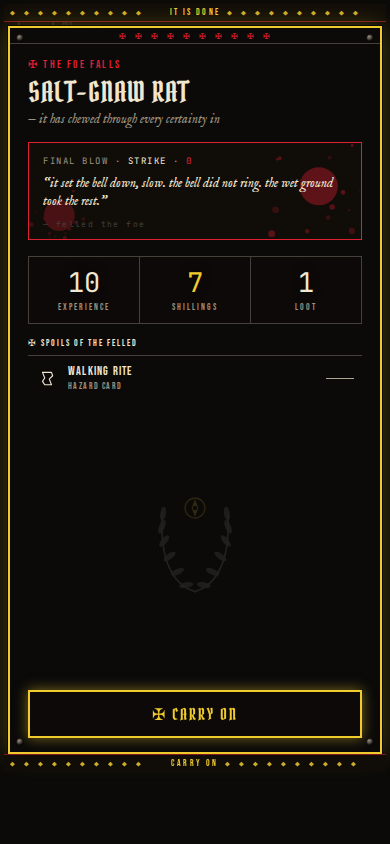 |

### Combat — aftermath (victory)
The win was anticlimactic: flat reward numbers, an empty middle. Now: larger
glowing reward values, a ceremonial laurel watermark filling the void, and a
gold-glow CARRY ON.

| Before | After |
|---|---|
| 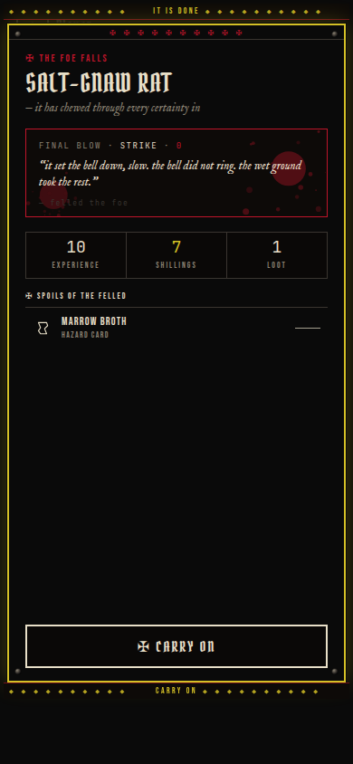 | 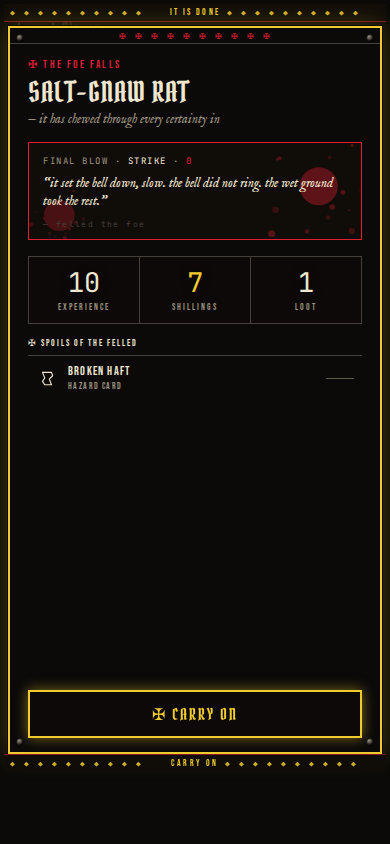 |

### Boss prelude — **bespoke crowned tyrant**
The Coastal Tyrant is now an enthroned, gold-crowned figure cohesive with the
new art style (was a placeholder).

| Before | After |
|---|---|
| 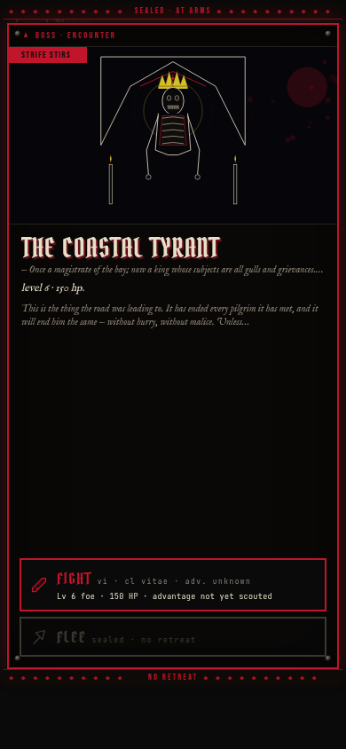 | 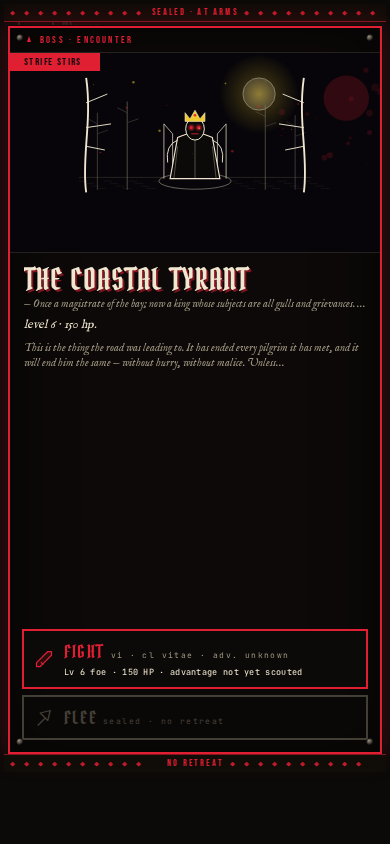 |

### Hazard intro
| Before | After |
|---|---|
| 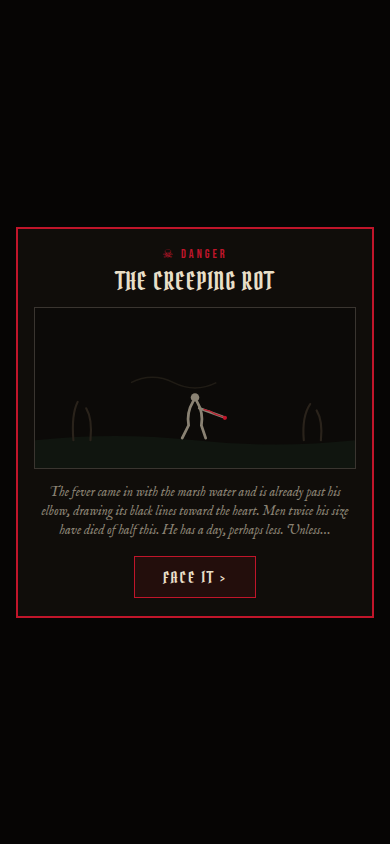 | 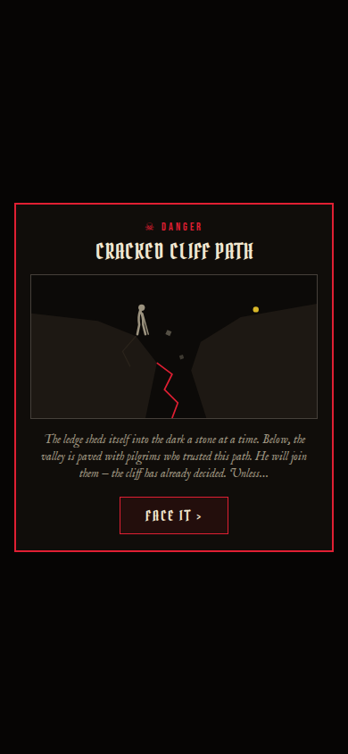 |

### Hazard board + Dialogue (newly captured)
The hazard route-select board (colored route cards popping under the new palette)
and the dedicated dialogue screen — neither had an after-capture before.

| Hazard board | Dialogue |
|---|---|
| 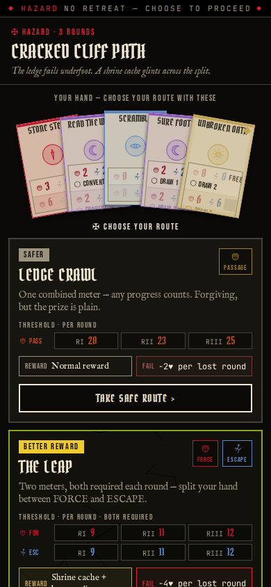 | 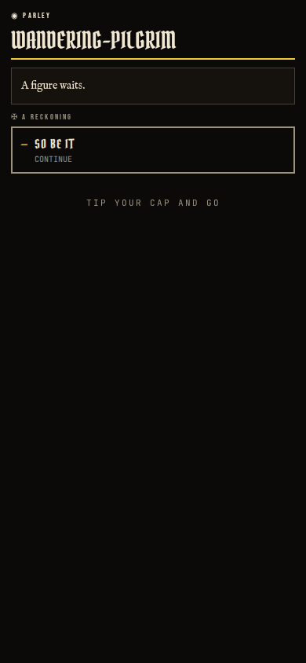 |

---

## Theme showcase (dev switcher)

The same exploration screen under each biome preview theme — flip them live from
the SELF-tab dev menu.

| Coastal Verdant | Ember Depths |
|---|---|
| 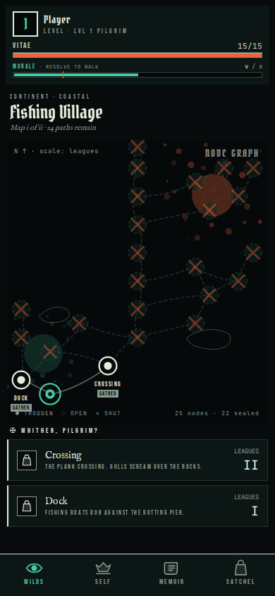 | 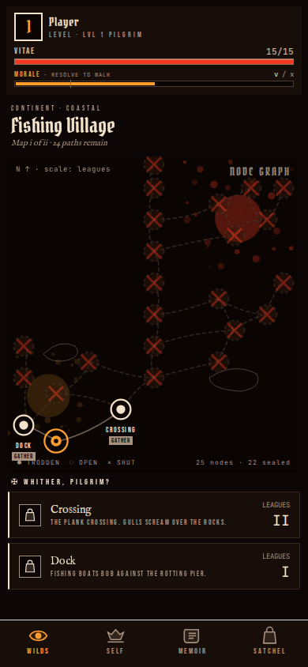 |

| Frost Marrow | Plague Bloom |
|---|---|
| 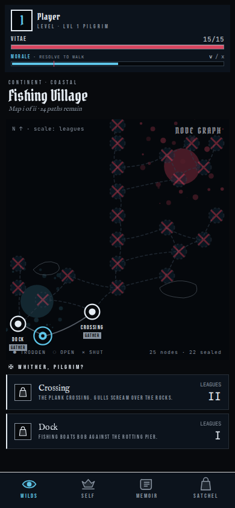 | 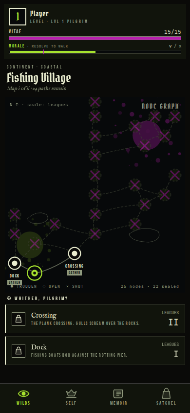 |

---

## Not yet done (proposed follow-ups)

This pass landed the **foundation** (theming, global palette pop) + the
**showcase** screens (title, encounter art). The global palette already lifts
every screen, but these had no individual layout/art pass yet — prioritised for
the next round:

- **Capture the remaining minigame boards** — gathering, rest, loot-cache, and
  the quest board need proper e2e-style capture (seed injection + intro
  dismissal, like `gathering-e2e.mjs`); the quick dev-trigger lands on an empty
  event fallback. Village + cutscene also still lack after-captures.
- **Hand-tuned art for marquee bosses** — beyond their archetype illustration.
- **Per-screen hierarchy passes** for Satchel + Memoir (not yet individually
  reworked — they have the global palette lift only).
- **Tab-bar icon refresh** — serviceable today; could gain filled/glow active
  states.
