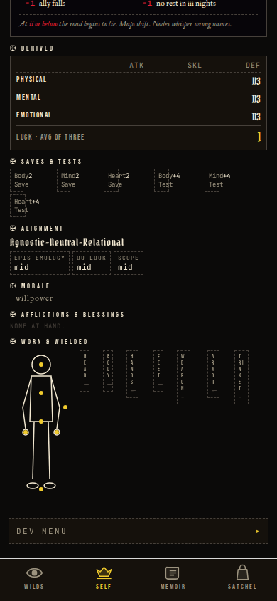

# Visual / UX Audit — June 2026

**Goal:** push the UI toward *engagement* — new-player clarity, readability,
and visual *pop* — without losing the dark-gothic identity. Bold direction:
layout & hierarchy rework, a real theming system, and custom SVG art.

All captures are iPhone-portrait (390×844), driven through the dev menu on the
exported web build (`scripts/audit-capture.mjs`).

---

## What changed (foundation)

### 1. A theming system (`theme/palette.ts`)

Colour accents are now **theme-driven**. A registry of named palettes is derived
from ~17 base hues via `makePalette()`; `theme/axm.ts` resolves the active
palette **once at module-load**, so all 150+ components that read `AXM.*` pick up
the theme with **zero per-component change**. Switching reloads the bundle so the
new palette re-resolves cleanly (robust against React Native's static
`StyleSheet.create` caching).

- **Integrated default — `Ashen Gold`:** the canonical palette retuned toward
  richer, higher-contrast accents (brighter gold, a more saturated blood-red,
  crisper parchment). This is the "pop" you see on *every* screen below.
- **Dev switcher (`DebugThemeSwitcher`):** buttons in the SELF-tab dev menu flip
  the active colour theme live — a preview harness for the future biome worlds.
- **Biome preview themes:** `Coastal Verdant`, `Ember Depths`, `Frost Marrow`,
  `Plague Bloom` (see the gallery at the bottom).

### 2. Custom SVG art

- **`TitleEmblem`** — a heraldic crest (a radiant *eye of knowledge* above a
  *sword of steel*, framed by an astrolabe ring + sulfur halo). Theme-aware.
- **`EncounterIllustration`** — rewritten from a crude placeholder into a moonlit
  clearing: a horned creature with glowing eyes, a layered treeline for depth, a
  glowing moon, and drifting embers.
- **`FiligreeRule`** — reusable diamond-centred divider for framing text blocks.

---

## Screen-by-screen

> Left = **before** (pre-audit). Right = **after**.

### Title
The weakest first impression — all text, dead-empty top. Now anchored by the
crest, with a glowing wordmark, a framed gold subtitle, filigree-framed flavor,
and a glowing call-to-action.

| Before | After |
|---|---|
|  |  |

### Exploration (WILDS)
Global palette lift: brighter gold tab + labels, richer vitae red, crisper
parchment headings. The map reads with more contrast.

| Before | After |
|---|---|
|  |  |

### Character / SELF (top + scrolled)
Stronger accent contrast on stat values, derived table, and the paper-doll
figure.

| Before (top) | After (top) |
|---|---|
|  |  |

| Before (mid) | After (mid) |
|---|---|
|  |  |

### Satchel
| Before | After |
|---|---|
|  |  |

### Memoir
| Before | After |
|---|---|
|  |  |

### Combat prelude — **new illustration**
The headline art change: the placeholder creature scene is now an atmospheric
moonlit clearing with a horned, glowing-eyed beast.

| Before | After |
|---|---|
|  |  |

### Combat — the fight
Brighter stance/selection gold, richer vitae red, and skill-fuel chips
(BODY/HEART/MIND/FALLACY/PARADOX) now track the theme accents.

| Before | After |
|---|---|
|  |  |

### Boss prelude
| Before | After |
|---|---|
|  |  |

### Hazard intro
| Before | After |
|---|---|
|  |  |

---

## Theme showcase (dev switcher)

The same exploration screen under each biome preview theme — flip them live from
the SELF-tab dev menu.

| Coastal Verdant | Ember Depths |
|---|---|
|  |  |

| Frost Marrow | Plague Bloom |
|---|---|
|  |  |

---

## Not yet done (proposed follow-ups)

This pass landed the **foundation** (theming, global palette pop) + the
**showcase** screens (title, encounter art). The global palette already lifts
every screen, but these had no individual layout/art pass yet — prioritised for
the next round:

- **Combat sub-phases** (DO / LET action menus, round 2, aftermath) — not
  recaptured here; the in-combat interaction is fiddly to script. Layout rework
  pending.
- **Bespoke enemy / boss art** — the boss is still the older placeholder figure;
  per-creature illustrations are the natural next "go big" step.
- **Per-screen hierarchy passes** for Satchel, Memoir, Character, and the
  event/minigame screens (rest, gather, treasure, quest, gathering, cache,
  dialogue, village, cutscene).
- **Tab-bar icon refresh** — serviceable today; could gain filled/glow active
  states.
